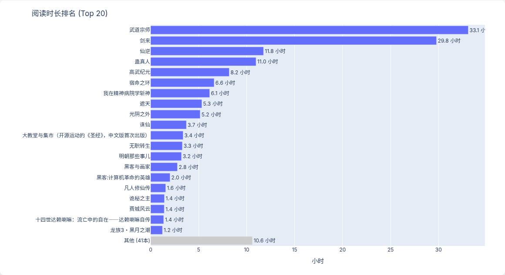
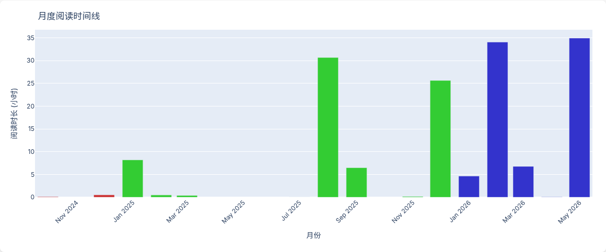
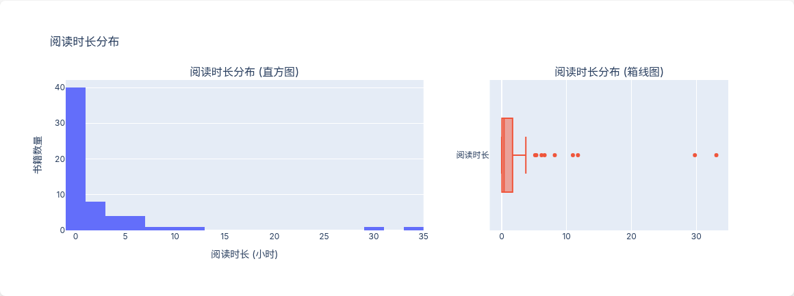
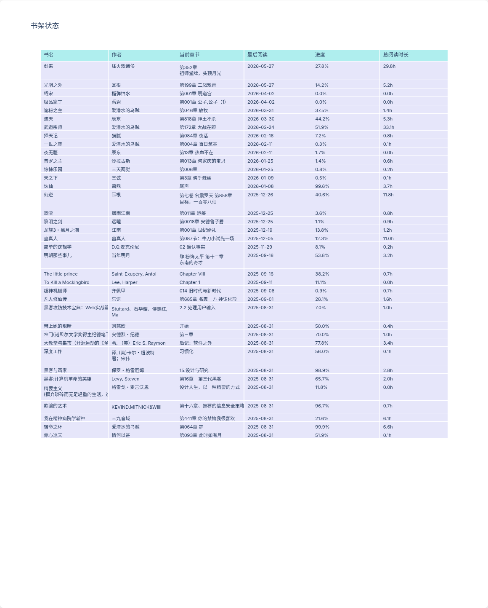
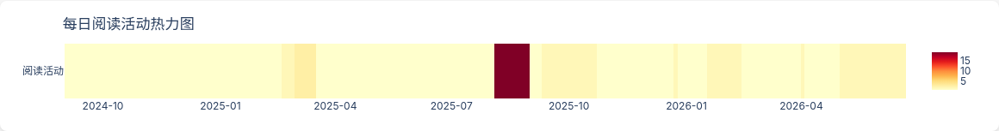

# Pylook 阅读可视化报告

从 [Legado（阅读）](https://github.com/gedoor/legado) 备份数据生成的可交互阅读数据看板。

## 数据总览

| 指标 | 数值 |
|------|------|
| 去重后书籍 | 61 本 |
| 书架在读 | 37 本 |
| 总阅读时长 | 153 小时（6.4 天） |

### 阅读时长 Top 10

| 排名 | 书名 | 作者 | 阅读时长 |
|------|------|------|----------|
| 1 | 武道宗师 | 爱潜水的乌贼 | 33.1h |
| 2 | 剑来 | 烽火戏诸侯 | 29.8h |
| 3 | 仙逆 | 耳根 | 11.8h |
| 4 | 蛊真人 | 蛊真人 | 11.0h |
| 5 | 高武纪元 | — | 8.2h |
| 6 | 宿命之环 | 爱潜水的乌贼 | 6.6h |
| 7 | 我在精神病院学斩神 | 三九音域 | 6.1h |
| 8 | 遮天 | 辰东 | 5.3h |
| 9 | 光阴之外 | 耳根 | 5.2h |
| 10 | 诛仙 | 萧鼎 | 3.7h |

## 可视化图表

### 阅读时长排名（Top 20）



### 月度阅读时间线



### 阅读时长分布



### 书架状态



### 每日阅读活动热力图



## 使用方式

```bash
# 安装依赖
yay -S python-plotly python-playwright

# 运行
python3 visualize.py

# 打开交互式报告（浏览器）
open output/reading_report.html
```

## 数据来源

数据来自 Legado（阅读）App 的备份文件 `backup/readRecord.json` 和 `backup/bookshelf.json`。

- `readTime` 单位：毫秒，除以 3,600,000 转为小时
- `lastRead` / `durChapterTime`：毫秒 Unix 时间戳
- 同名书籍（不同版本/格式）自动合并

## 技术栈

- Python 3 + Plotly 6（交互式图表）
- Playwright（静态截图）
- 思源黑体 / Sarasa Gothic（中文渲染）
- GitHub Pages / raw 直链（图片托管）
